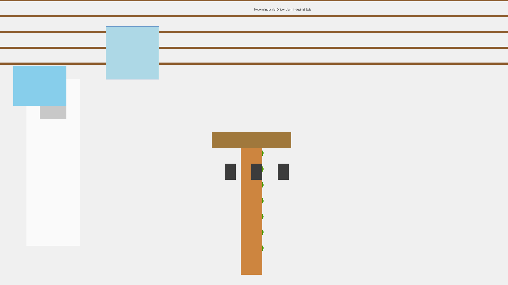

# 现代轻工业风格办公室设计

[](办公室效果图.png)

## 项目概述

现代轻工业风格办公室空间设计方案，本仓库包含效果图、3D 模型、设计文档和 AI 绘图提示词.

## 文件列表

### 效果图
- **办公室效果图.png** - 主视角效果图（1920x1080）
- **办公室3D效果图.html** - 可交互 3D 模型（用浏览器打开）

### 设计文档
- **办公室设计方案-现代轻工业风.pdf** - 完整设计方案（850KB）
  - 设计理念
  - 预算明细（约20万元）
  - 施工建议
  - 材料清单

### AI 绘图工具
- **办公室效果图-AI绘图提示词.md** - 专业提示词
  - 5个不同视角
  - 适用于 Midjourney/DALL-E/Leonardo.ai

## 设计亮点

### 核心元素
- ✅ 高斜顶 + 裸露木梁
- ✅ 中央楼梯 + 绿植墙
- ✅ 形象墙 + LOGO
- ✅ 吧台区域 + 工业风吊灯
- ✅ 二楼玻璃房（通透）

### 设计风格
- **现代** + **轻工业**
- 材质：混凝土 + 原木 + 黑色金属 + 玻璃
- 色彩：白色/灰色基调 + 绿色植物点缀
- 氛围：高雅、现代、通透

## 成本控制

- 总预算：约 **20万元**（不含设计费）
- 最大单项：楼梯+绿景（47,400元，23.4%）
- 成本优化：裸顶设计节省吊顶费用

## 使用说明

### 查看效果图
```bash
# 打开主效果图
open 办公室效果图.png

# 打开 3D 模型（需要浏览器）
open 办公室3D效果图.html
```

### 使用 AI 工具生成更多效果图

1. 打开 `办公室效果图-AI绘图提示词.md`
2. 复制提示词到 Midjourney/DALL-E/Leonardo.ai
3. 生成专业效果图

## 技术栈

- **效果图**: Python + PIL (Pillow)
- **3D 模型**: Three.js
- **文档**: Markdown + mdpdf

## 项目信息

- **客户**: 吕总
- **地点**: 办公室
- **日期**: 2026-03-26
- **版本**: V1.0

---

**设计团队**: OpenClaw AI  
**联系方式**: [GitHub Repository](https://github.com/blqbzf/office-design)
